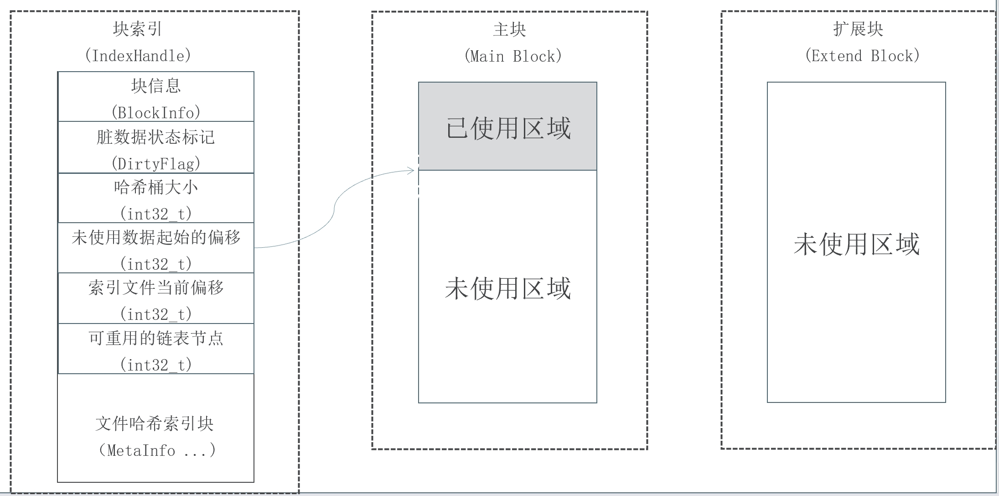
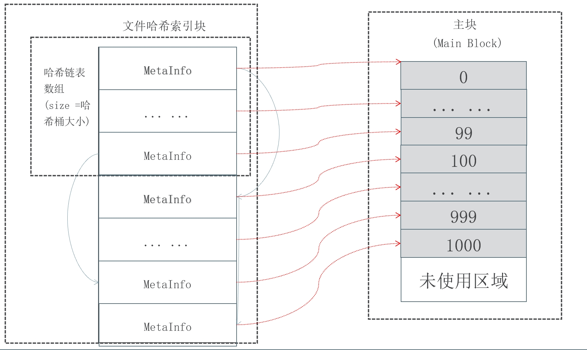
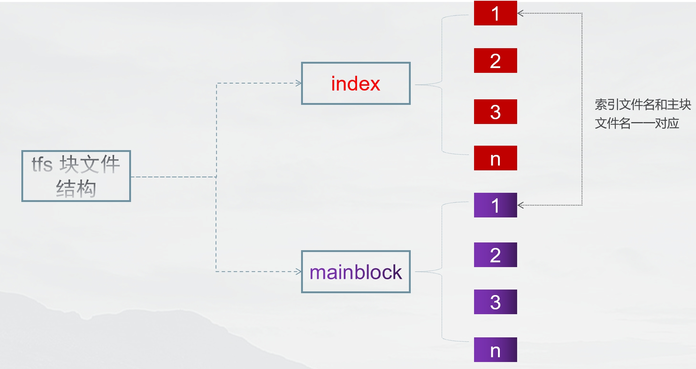

# tfs_largefile
淘宝分布式文件系统引擎，核心部分大文件结构的实现，利用**大文件块**、**特殊的数据结构**以及**内存映射**等操作对海量小型数据进行高效管理（更多针对小型数据的插入、查询、读取以及删除）

---

# 📂文件说明

- tests文件夹：单元测试所使用
- images文件夹：用于保存本项目的一些图片
- common.h：用来存储公共部分（包括一些宏定义、头文件以及关键数据结构...）
- mmap_file.cpp：内存映射类的实现
- file_op.cpp:文件操作类的实现
- mmap_file_op.cpp:文件映射操作类的实现
- index_handle.cpp:文件索引操作类的实现

---

# 🚀相关类图及结构图

## ⭐设计类图

---
## ⭐大文件存储结构图

---
## ⭐文件哈希链表实现图

---

## ⭐tfs块文件结构图

--------
# 🍎相关博客地址： 
[淘宝分布式文件系统引擎（一） 文件系统基本概念](https://blog.csdn.net/Jacksqh/article/details/110955359)

[淘宝分布式文件系统引擎（一） 文件系统基本概念](https://blog.csdn.net/Jacksqh/article/details/111140881)

[淘宝分布式文件系统引擎（三） 淘宝的大文件存储结构](https://blog.csdn.net/Jacksqh/article/details/111186382)

[淘宝分布式文件系统引擎（四）哈希链表结构以及内存映射](https://blog.csdn.net/Jacksqh/article/details/111409479)

[淘宝分布式文件系统引擎（五） 内存映射实战](https://blog.csdn.net/Jacksqh/article/details/111463393)