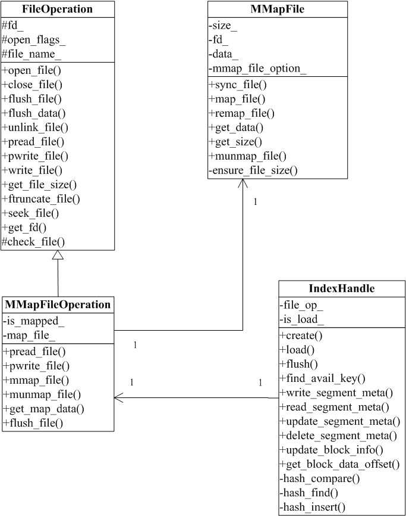

# tfs_largefile
淘宝分布式文件系统，核心部分大文件结构的实现
# 📂文件说明

- tests文件夹：单元测试所使用
- images文件夹：用于保存本项目的一些图片
- common.h：用来存储公共部分（包括一些宏定义以及头文件..）
- mmap_file.cpp：内存映射类的实现
- file_op.cpp:文件操作类的实现
- mmap_file_op.cpp:文件映射操作类的实现

# 🚀设计类图

