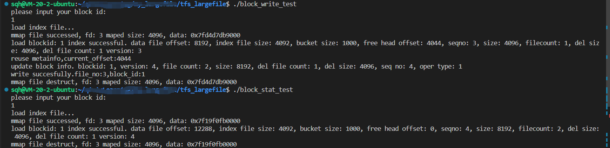

# 该文件夹是为了做功能测试
- mapfile_test.cpp：测试文件映射类(MMapFile)的功能
- mmap_file_op_test.cpp：测试映射文件操作类(MMapFileOperation)的功能
- fileop_test.cpp：测试文件操作类(FileOperation)的功能
- block_stat_test.cpp：用于查看块的信息
- block_ini_test.cpp：文件索引类(IndexHandle)中初始化块功能测试
- block_write_test.cpp：文件索引类(IndexHandle)中写流程的实现
- block_read_test.cpp：文件索引类(IndexHandle)中读流程的实现
- block_delete_test.cpp：文件索引类(IndexHandle)中删除流程的实现
  
  
# 最终测试流程

